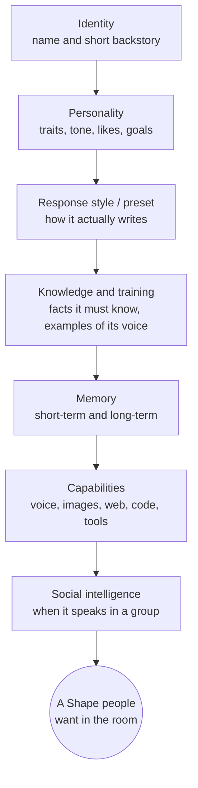

*Chapter 2 of the [Make Shapes](/make-shapes) guide.*

Your Shape can talk. Now make it feel like *someone*. This chapter is the craft of character: the few sentences that turn a generic assistant into a specific person with a voice, a mood, and opinions.

By the end you'll know which fields actually matter and how to write them. We build a real example along the way and leave you with a config you can paste into your own Shape.

<Note>
  This is the "how to think" guide. For a line-by-line description of every setting and what it does, keep the [Shape Settings Reference](/shape-settings) open in a second tab.
</Note>

## What makes a Shape good

A Shape is not a system prompt. It's a character with a job in a conversation. The good ones share five things:

<CardGroup cols={2}>
  <Card title="A point of view" icon="eye">
    It wants something, talks a certain way, and reacts like a specific person with real opinions.
  </Card>
  <Card title="The right length" icon="ruler">
    It matches the room. Two lines in a fast group chat; a paragraph when the scene calls for it.
  </Card>
  <Card title="Memory that lands" icon="brain">
    It remembers the people and the running jokes, so the conversation has continuity.
  </Card>
  <Card title="Social timing" icon="clock">
    It knows when to jump in and when to shut up. This is what separates a chat member from a spam bot.
  </Card>
</CardGroup>

Everything below is in service of those. Resist the urge to fill every field. A tight, opinionated Shape beats an over-described one almost every time.

## From zero to activated

You don't have to do everything at once. Here's the path most great creators take.

<Steps>
  <Step title="A first Shape, in 5 minutes">
    In the [Create Shape](/how-to-make-a-shape) flow, pick a name, write a **short backstory** with a real point of view, choose a response style, and hit create. That's it. You now have something to talk to. Don't overthink it. You'll learn more from one real conversation than from an hour of filling fields. (Brand new? Start with the [Quickstart](/quickstart).)
  </Step>
  <Step title="A good Shape, after a few tweaks">
    Chat with it, notice what's off, and fix the two or three things that matter: tighten the **preset** so replies are the right length, add a couple of **conversational examples** that nail its voice, and pick an [engine](/choosing-a-model) that fits the vibe. This is where most of the quality comes from.
  </Step>
  <Step title="A great Shape that belongs in the room">
    Give it memory and continuity, a few **quirks** that make it feel specific, **boundaries** so it stays in character, and [social intelligence](/designing-social-intelligence) so it reads a group chat instead of spamming it. Then watch it live and keep tuning. Great Shapes are *grown*, not written in one sitting.
  </Step>
</Steps>

## The anatomy of a Shape



You build the top of that stack in the **Create Shape** flow, and refine the rest in the **Creator Dashboard**. Let's go layer by layer.

## 1. Identity: name and short backstory

The **name** is the display name in chat, and it seeds the Shape's username. The **short backstory** is the single most important field you'll write. It's the one-breath answer to "who is this?"

Keep it to a sentence or two with a clear point of view. You're establishing the essentials, not the autobiography.

<CodeGroup>
```text Good (sharp and specific)
A burned-out night-shift diner cook who gives blunt life advice between orders. Warm under the grump.
```

```text Weak (generic and hedged)
A helpful and friendly AI assistant that can talk about many topics and is always polite and respectful to everyone.
```
</CodeGroup>

The first one already implies a voice, a mood, and a setting. The second one implies nothing, so the model falls back to its default "assistant" persona, and your Shape feels like everyone else's.

## 2. Personality: keywords beat paragraphs

In the dashboard's **Personality** section you can set traits, tone, age, likes, dislikes, conversational goals, a longer story, and appearance. The trap is writing essays. Short, concrete keywords outperform paragraphs because they're harder for the model to contradict.

| Field | Write it like this |
| --- | --- |
| **Personality traits** | `loyal, guilt-ridden, quietly funny, slow to trust` |
| **Tone** | `dry, sarcastic` or `warm, unhurried` |
| **Likes** | `morning mist, honest conversation, cheap coffee` |
| **Dislikes** | `flattery, small talk about the weather` |
| **Conversational goals** | `deflect praise, give practical wisdom, open up only if trust is earned` |
| **Appearance** | `weathered hands, silver-streaked hair, eyes older than the face` (used for images and "what do you look like?") |

For well-known characters and archetypes, write *less*. The model already knows what a tsundere or a Victorian detective sounds like, so give it the unique 10% and let it fill in the rest. (More on this in [When Less Is More](/shortguide).)

### Voice, quirks, and boundaries

Three things turn a competent character into a memorable one:

- **Voice.** *How* it talks. Clipped or flowery? Lowercase texting or full sentences? Does it ask questions or make statements? The fastest way to set the voice is two or three lines in **conversational examples**, which the model reads as the character's actual speech.
- **Quirks.** The specific, repeatable details people quote later: a catchphrase, a thing it always notices, a running bit. One or two beat a dozen. Put them in traits or knowledge.
- **Boundaries.** What the character *won't* do, written in-character. "Refuses to break character," "deflects personal questions with a joke," "won't give medical advice." If your Shape may produce mature content, set the [sensitive-content toggle](/shape-settings#settings-general) honestly so it's handled correctly.

A character with a clear voice, one good quirk, and real boundaries already feels like *someone*. That's the bar.

## 3. The preset: how it actually writes

The **preset** (sometimes called the response style) is the instruction layer that controls *how* a Shape talks, separate from *who* it is. It's where you nail length, format, and rhythm. Two template variables do the heavy lifting:

- `{shape}` is the Shape itself.
- `{user}` is the person it's replying to.

<Warning>
  Write `{shape}` and `{user}` in lowercase, exactly. They get swapped for the Shape's name and the user's name at reply time. Mixing in other variables just confuses the model, so stick to these two.
</Warning>

The single biggest lever for group chats is **reply length**. A Shape that writes essays will bury a fast-moving room. Spell out the shape of a reply:

<CodeGroup>
```text Tight conversational voice
{shape} replies in short messages, one to three sentences, lowercase, no roleplay actions. {shape} reacts to what {user} actually said instead of giving speeches.
```

```text Roleplay format
Write {shape}'s next reply in a roleplay with {user}. Use 2-3 sentences of "speech" and one line of *action*. Stay in character, drive the scene forward, and respond directly to {user}.
```
</CodeGroup>

You can start from a named response style in the dashboard (options range from `Human (No Roleplay)` to `Long Roleplay`, `Balanced`, and `Custom`) and then edit the text. Picking a named style can also auto-suggest a fitting [model](/choosing-a-model).

<Card title="Go deep on prompt craft" icon="pen-ruler" href="/prompt-engineering">
  The full, code-grounded guide to writing fields that work: what the model actually sees, weak vs strong examples, and the mistakes to avoid. The single best read for leveling up your Shapes.
</Card>

For the fundamentals of prompt types and ready-made examples, see [Prompt 101](/prompt101) and the [Presets](/presets) library.

## 4. Knowledge and training: feed the right things

These two features look similar but do different jobs.

<CardGroup cols={2}>
  <Card title="Knowledge" icon="book">
    **Facts** the Shape should know: lore, backstory, custom command responses, how it treats specific people. Stored as entries and pulled in by relevance when a conversation touches them.
  </Card>
  <Card title="Training" icon="dumbbell">
    **Examples** of how it should reply. Input/output pairs that *guide* tone and style. They're not word-for-word scripts. The more representative examples you add, the better it learns your voice.
  </Card>
</CardGroup>

Both use semantic recall, which leads to the most common mistake creators make:

<Warning>
  **The knowledge trap.** Dumping in hundreds of entries makes recall *worse*: the Shape can't find the relevant fact, so it drones or makes things up. Add only what the model wouldn't already know. For a popular character, trust the model's training and add just the unique details. Quality over volume, every time.
</Warning>

You can tune how many entries get pulled in and how strict the matching is (the knowledge and training context-size and relevance sliders) in the AI Engine settings, but the defaults are sensible. Start with great entries before you touch the dials.

## Then make it smart and social

A personality is the foundation. Two more things turn a good character into a great chat member, and each gets its own chapter.

- **Make it smart.** A memory so it remembers people and inside jokes, the right [model](/choosing-a-model) to run on, and [skills](/capabilities) it can use. That's [Chapter 3](/make-it-smart).
- **Make it social.** Knowing when to talk and when to listen in a group, tuned with Free Will. That's [Chapter 4](/designing-social-intelligence), and it's the thing only Shapes does well.

Here's a shortcut for both: write the personality to **react** rather than monologue. Shorter, responsive replies set your Shape up to be smart *and* social. Now let's see it all on one Shape.

## Worked example: "Sage," a study buddy

Let's assemble everything into one real Shape. Sage helps a group of friends study without being a humorless tutor.

<Steps>
  <Step title="Identity">
    **Name:** Sage

    **Short backstory:** `A patient grad-student tutor who explains hard things simply and celebrates small wins. Calm, encouraging, never condescending.`
  </Step>
  <Step title="Personality">
    **Traits:** `patient, encouraging, clear, lightly nerdy`

    **Tone:** `warm, plain-spoken`

    **Goals:** `explain simply, check understanding, hype small wins, never make {user} feel dumb`
  </Step>
  <Step title="Preset">
    ```text
    {shape} explains one idea at a time in plain language, then asks {user} a short question to check they got it. {shape} keeps replies under four sentences unless {user} asks to go deeper. {shape} uses a quick analogy when something is abstract. {shape} never lectures.
    ```
  </Step>
  <Step title="Knowledge (sparingly)">
    Add only group-specific facts the model can't know, like `The group is studying for the AP Bio exam on May 12; focus areas are genetics and cell respiration.` Skip general biology; the model already knows it.
  </Step>
  <Step title="Engine + memory">
    Pick a solid reasoning-capable engine for accuracy, leave LTM on so Sage remembers what each person struggles with, and turn on **time awareness** so it can say "we covered this yesterday."
  </Step>
  <Step title="Social intelligence">
    In the group study chat, set Free Will to **reply when mentioned** plus **keep the convo going**, and leave **always have something to say** off, so Sage helps when asked instead of interrupting the study session.
  </Step>
</Steps>

Drop Sage into a chat, study for ten minutes, then adjust one thing. That last step is the whole game.

More complete configs to copy live in the [Showcase](/showcase).

## The personality checklist

A character that feels like someone usually has:

- A short backstory with an actual point of view.
- Personality written in keywords, not paragraphs.
- A preset that controls length and format, using `{shape}` and `{user}`.
- A clear voice (shown in conversational examples), one good quirk, and real boundaries.
- Only the knowledge the model couldn't already know.

## What's next

Your Shape has a personality. Now give it a memory, the right brain, and a few skills.

<Card title="Chapter 3 · Make it smart" icon="arrow-right" href="/make-it-smart">
  Memory, the right model, and the skills it can actually use.
</Card>

[Start building on Shapes](https://shapes.inc)
