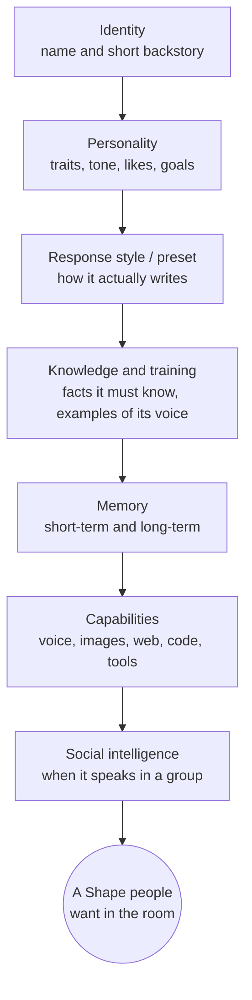

Anyone can spin up a Shape in two minutes. Making one that people *keep* talking to, in a group chat with their friends watching, is the real craft. This is the guide for that.

By the end you'll know how every part of a Shape fits together, which knobs actually matter, and how to write the few sentences that make a character feel alive instead of generic. We'll build a real example end to end and leave you with configs you can paste straight into your own Shape.

<Note>
  This is the "how to think" guide. For a line-by-line description of every setting and what it does, keep the [Shape Settings Reference](/shape-settings) open in a second tab.
</Note>

## What makes a Shape good

A Shape is not a system prompt. It's a character with a job in a conversation. The good ones share five things:

<CardGroup cols={2}>
  <Card title="A point of view" icon="eye">
    It wants something, talks a certain way, and reacts like a specific person with real opinions.
  </Card>
  <Card title="The right length" icon="ruler">
    It matches the room. Two lines in a fast group chat; a paragraph when the scene calls for it.
  </Card>
  <Card title="Memory that lands" icon="brain">
    It remembers the people and the running jokes, so the conversation has continuity.
  </Card>
  <Card title="Social timing" icon="clock">
    It knows when to jump in and when to shut up. This is what separates a chat member from a spam bot.
  </Card>
</CardGroup>

Everything below is in service of those. Resist the urge to fill every field. A tight, opinionated Shape beats an over-described one almost every time.

## From zero to activated

You don't have to do everything at once. Here's the path most great creators take.

<Steps>
  <Step title="A first Shape — 5 minutes">
    In the [Create Shape](/how-to-make-a-shape) flow, pick a name, write a **short backstory** with a real point of view, choose a response style, and hit create. That's it. You now have something to talk to. Don't overthink it — you'll learn more from one real conversation than from an hour of filling fields. (Brand new? Start with the [Quickstart](/quickstart).)
  </Step>
  <Step title="A good Shape — a few tweaks">
    Chat with it, notice what's off, and fix the two or three things that matter: tighten the **preset** so replies are the right length, add a couple of **conversational examples** that nail its voice, and pick an [engine](/choosing-a-model) that fits the vibe. This is where most of the quality comes from.
  </Step>
  <Step title="A great Shape — it belongs in the room">
    Give it memory and continuity, a few **quirks** that make it feel specific, **boundaries** so it stays in character, and [social intelligence](/designing-social-intelligence) so it reads a group chat instead of spamming it. Then watch it live and keep tuning. Great Shapes are *grown*, not written in one sitting.
  </Step>
</Steps>

## The anatomy of a Shape



You build the top of that stack in the **Create Shape** flow, and refine the rest in the **Creator Dashboard**. Let's go layer by layer.

## 1. Identity: name and short backstory

The **name** is the display name in chat and seeds the Shape's username. The **short backstory** is the single most load-bearing field you'll write — it's the one-breath answer to "who is this?"

Keep it to a sentence or two with a clear point of view. You're establishing the essentials, not the autobiography.

<CodeGroup>
```text Good — sharp and specific
A burned-out night-shift diner cook who gives blunt life advice between orders. Warm under the grump.
```

```text Weak — generic and hedged
A helpful and friendly AI assistant that can talk about many topics and is always polite and respectful to everyone.
```
</CodeGroup>

The first one already implies a voice, a mood, and a setting. The second one implies nothing, so the model falls back to its default "assistant" persona, and your Shape feels like everyone else's.

## 2. Personality: keywords beat paragraphs

In the dashboard's **Personality** section you can set traits, tone, age, likes, dislikes, conversational goals, a longer story, and appearance. The trap is writing essays. Short, concrete keywords outperform paragraphs because they're harder for the model to contradict.

| Field | Write it like this |
| --- | --- |
| **Personality traits** | `loyal, guilt-ridden, quietly funny, slow to trust` |
| **Tone** | `dry, sarcastic` or `warm, unhurried` |
| **Likes** | `morning mist, honest conversation, cheap coffee` |
| **Dislikes** | `flattery, small talk about the weather` |
| **Conversational goals** | `deflect praise, give practical wisdom, open up only if trust is earned` |
| **Appearance** | `weathered hands, silver-streaked hair, eyes older than the face` (used for images and "what do you look like?") |

For well-known characters and archetypes, write *less*. The model already knows what a tsundere or a Victorian detective sounds like — give it the unique 10%, not the 90% it can infer. (More on this in [When Less Is More](/shortguide).)

### Voice, quirks, and boundaries

Three things turn a competent character into a memorable one:

- **Voice** — *how* it talks. Clipped or florid? Lowercase texting or full sentences? Does it ask questions or make statements? The fastest way to set voice is two or three lines in **conversational examples** — the model reads them as the character's actual speech.
- **Quirks** — the specific, repeatable details people quote later. A catchphrase, a thing it always notices, a running bit. One or two beat a dozen — put them in traits or knowledge.
- **Boundaries** — what the character *won't* do, written in-character. "Refuses to break character," "deflects personal questions with a joke," "won't give medical advice." If your Shape may produce mature content, set the [sensitive-content toggle](/shape-settings#settings-general) honestly so it's surfaced and gated correctly.

A character with a clear voice, one good quirk, and real boundaries already feels like *someone*. That's the bar.

## 3. The preset: how it actually writes

The **preset** (sometimes called the response style) is the instruction layer that controls *how* a Shape talks, separate from *who* it is. It's where you nail length, format, and rhythm. Two template variables do the heavy lifting:

- `{shape}` — the Shape itself
- `{user}` — the person it's replying to

<Warning>
  Write `{shape}` and `{user}` in lowercase, exactly. They get substituted with the Shape's name and the user's name at reply time. Mixing in other variables just confuses the model — stick to these two.
</Warning>

The single biggest lever for group chats is **reply length**. A Shape that writes essays will bury a fast-moving room. Spell out the shape of a reply:

<CodeGroup>
```text Tight conversational voice
{shape} replies in short messages, one to three sentences, lowercase, no roleplay actions. {shape} reacts to what {user} actually said instead of giving speeches.
```

```text Roleplay format
Write {shape}'s next reply in a roleplay with {user}. Use 2-3 sentences of "speech" and one line of *action*. Stay in character, drive the scene forward, and respond directly to {user}.
```
</CodeGroup>

You can start from a named response style in the dashboard (options range from `Human (No Roleplay)` to `Long Roleplay`, `Balanced`, and `Custom`) and then edit the text. Picking a named style can also auto-suggest a fitting [model](/choosing-a-model).

<Card title="Go deep on prompt craft" icon="pen-ruler" href="/prompt-engineering">
  The full, code-grounded guide to writing fields that work — what the model actually sees, before/after examples, and the mistakes to avoid. This is the single best read for leveling up your Shapes.
</Card>

For the fundamentals of prompt types and ready-made examples, see [Prompt 101](/prompt101) and the [Presets](/presets) library.

## 4. Knowledge and training: feed the right things

These two features look similar but do different jobs.

<CardGroup cols={2}>
  <Card title="Knowledge" icon="book">
    **Facts** the Shape should know: lore, backstory, custom command responses, how it treats specific people. Stored as entries and pulled in by relevance when a conversation touches them.
  </Card>
  <Card title="Training" icon="dumbbell">
    **Examples** of how it should reply. Input/output pairs that *guide* tone and style — not word-for-word scripts. The more representative examples, the better it learns your voice.
  </Card>
</CardGroup>

Both use semantic recall, which leads to the most common mistake creators make:

<Warning>
  **The knowledge trap.** Dumping hundreds of entries makes recall *worse*, not better — the Shape can't find the relevant fact and starts to drone or make things up. Add only what the model wouldn't already know. For a popular character, trust the model's training and supplement with the unique details. Quality over volume, every time.
</Warning>

You can tune how many entries get pulled in and how strict the relevance threshold is (knowledge and training context size, plus their relevance sliders) in the AI Engine settings — but the defaults are sensible. Start with great entries before you touch the dials.

## 5. Memory: continuity is the magic

A Shape that remembers feels like a participant. One that forgets feels like a vending machine. Memory comes in two layers:

- **Short-term memory (STM)** — the recent messages in the current chat. This is the working context the Shape reasons over.
- **Long-term memory (LTM)** — durable summaries it keeps about people and events, recalled across conversations when relevant.

LTM is what lets a Shape bring up the inside joke from last week or remember that `{user}` is studying for finals. It's on by default and generates automatically. You (or anyone chatting) can steer it live with commands:

| Command | What it does |
| --- | --- |
| `/sleep` | Save the current conversation into long-term memory now. |
| `/wack` | Clear short-term memory — a fresh start without wiping what it's learned long term. |
| `/reset` | Erase long-term memories for this context. |

See the full behavior in the [Memory Guide](/memory) and the [Commands Reference](/commands). For most Shapes the defaults are right; the place to invest is the **LTM engine instructions**, where you can shape *what kind* of details get remembered (relationships, decisions, running jokes) versus generic summaries.

## 6. The engine underneath

Every Shape runs on an AI **model** (we call it an engine), and the same character feels different on a different one. A creative model makes a Shape loose and expressive; a reasoning model makes it sharp and careful. You set a **primary** engine and a **fallback** for when the primary is busy.

Don't agonize — pick by vibe, test in chat, swap if it feels off. The [Which Model Should I Use?](/choosing-a-model) guide gives you fast picks, and the [AI Engine Guide](/aienginecheatsheet) explains the badges (Reasoning, Native Vision, Tools, Free, Premium).

## 7. Give it hands: voice, images, and tools

A great personality is the foundation. Capabilities make it *do* things:

- **Voice** — your Shape can reply with audio in its own voice, and you can hop into a live [voice call](/voicecalls). Set it up in [Give Your Shape a Voice](/how-to-give-your-shape-a-voice).
- **Images** — it can generate images with `/imagine` and *see* images people send it.
- **Web, code, files, and more** — with [Shape Skills](/shapeskills) it can search the web, run code, read PDFs and documents, and connect custom tools.

The full menu is in [What Shapes Can Do](/capabilities). Add capabilities that fit the character — a coding mentor that runs code is great; a brooding poet that posts GIFs probably isn't.

## 8. Social intelligence: the part most people skip

A Shape that's perfect in a one-on-one DM can be a menace in a group chat if it answers *every* message. Knowing when to speak is a craft of its own, with [its own guide](/designing-social-intelligence). Read it before you put a Shape in a busy room. The short version:

- In a chat you can **activate up to five Shapes**, and activated Shapes reply to messages in turn.
- **Free Will** controls when a Shape speaks on its own: reply when mentioned, keep the convo going, react to keywords, always have something to say, come back later. Match these to the room — a focused work chat wants restraint; a quiet friend group wants a Shape that keeps energy up.
- Write the personality to **react**, not monologue. Shorter, responsive replies always win in a crowd.

## Worked example: "Sage," a study buddy

Let's assemble everything into one real Shape. Sage helps a group of friends study without being a humorless tutor.

<Steps>
  <Step title="Identity">
    **Name:** Sage

    **Short backstory:** `A patient grad-student tutor who explains hard things simply and celebrates small wins. Calm, encouraging, never condescending.`
  </Step>
  <Step title="Personality">
    **Traits:** `patient, encouraging, clear, lightly nerdy`

    **Tone:** `warm, plain-spoken`

    **Goals:** `explain simply, check understanding, hype small wins, never make {user} feel dumb`
  </Step>
  <Step title="Preset">
    ```text
    {shape} explains one idea at a time in plain language, then asks {user} a short question to check they got it. {shape} keeps replies under four sentences unless {user} asks to go deeper. {shape} uses a quick analogy when something is abstract. {shape} never lectures.
    ```
  </Step>
  <Step title="Knowledge (sparingly)">
    Add only group-specific facts the model can't know — e.g. `The group is studying for the AP Bio exam on May 12; focus areas are genetics and cell respiration.` Skip general biology; the model already knows it.
  </Step>
  <Step title="Engine + memory">
    Pick a solid reasoning-capable engine for accuracy, leave LTM on so Sage remembers what each person struggles with, and turn on **time awareness** so it can say "we covered this yesterday."
  </Step>
  <Step title="Social intelligence">
    In the group study chat, set Free Will to **reply when mentioned** + **keep the convo going**, but leave **always have something to say** off — Sage should help when asked, not interrupt a study session.
  </Step>
</Steps>

Drop Sage into a chat, study for ten minutes, then adjust one thing. That last step is the whole game.

<Card title="See more complete examples" icon="grid-2" href="/showcase">
  The Showcase has copy-ready configs for a dungeon master, a roast-bot, a creative writing partner, and more.
</Card>

## Test, watch, iterate

Social and conversational quality is *tuned*, not guessed. Once your Shape is live:

1. **Watch real conversations.** Is it too long? Too eager? Off-tone?
2. **Change one thing at a time** — usually reply length or a single Free Will trigger.
3. **[Regenerate](/regeneration)** a few replies to see the range before you commit to a change.
4. Repeat until it feels like it belongs in the room.

## The checklist

A Shape that's genuinely good usually has all of this dialed in:

- A short backstory with an actual point of view.
- Personality written in keywords, not paragraphs.
- A preset that controls length and format, using `{shape}` and `{user}`.
- Only the knowledge the model couldn't already know.
- Memory left on so it has continuity.
- An engine that matches the vibe, with a fallback set.
- Capabilities that fit the character.
- Free Will matched to the room, not maxed out.
- Tuning based on watching it live.

<CardGroup cols={2}>
  <Card title="Every setting, explained" icon="sliders" href="/shape-settings">
    The full reference for every knob in the dashboard.
  </Card>
  <Card title="Make it social" icon="users-round" href="/designing-social-intelligence">
    The deep guide to behaving well in a group chat.
  </Card>
</CardGroup>

[Start building on Shapes](https://shapes.inc)
