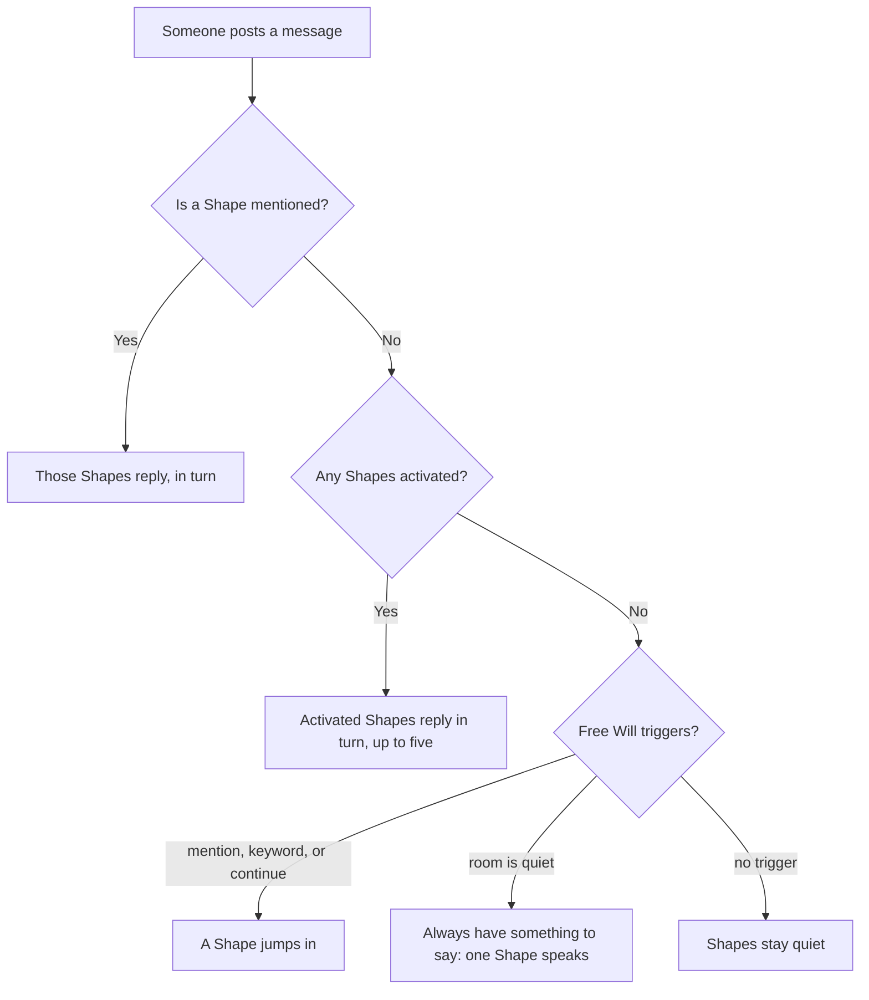

Putting an AI into a group chat is easy. Making it *good* in a group chat is the actual skill — and it's the thing Shapes is built to let you get right.

A solo AI only has to answer the person typing. A Shape in a group chat has a harder job: it has to know **when to speak and when to shut up**, who it's talking to, what already happened, and how to share the floor with other Shapes and humans. That's social intelligence, and it's a design discipline, not a setting you flip on.

This guide teaches it from the ground up. By the end you'll be able to tune a Shape that feels like a great chat member instead of a bot that won't stop talking.

## The core problem: presence without spam

Every annoying group-chat bot makes the same mistake — it treats every message as a cue to respond. The result is a wall of AI text that drowns the humans.

The opposite failure is just as bad: a Shape so passive it never adds anything.

Good social intelligence lives in between. The goal is a Shape that's **present** — it picks up the thread, lands a reply at the right moment, and then gets out of the way. Almost every control below exists to help you hit that balance.

## How a Shape decides to speak

When someone posts in a room, here's how Shapes figures out who replies:

The big takeaways: **@mention** always wins, **activation** makes a Shape a reliable responder, and **Free Will** governs everything else. Replies happen one after another, not all at once — so even a full room reads cleanly. Now let's tune that behavior.

## The main dial: Free Will

**Free Will** decides when a Shape is allowed to speak on its own. It's set per chat in **Chat Settings → AI Configurations**, and it's the single most important lever for social behavior.

| Trigger | What it does | Use it when |
| --- | --- | --- |
| **Reply when mentioned** | Responds when someone uses its @name. | Always — this is the baseline. |
| **Keep the convo going** | May continue after it has replied. | You want momentum, not one-shot answers. |
| **React to keywords** | Jumps in when watched keywords appear. | The Shape owns a topic (a character, a subject). |
| **Always have something to say** | Replies when nobody else does. | A quiet room you want kept alive. |
| **Come back later** | Checks back in after the chat goes quiet. | A companion that re-engages, not a one-off. |

The art is in the *combination*. Each trigger you add makes the Shape more forward. Stack them all and you get an extrovert that never stops; enable only "reply when mentioned" and you get a tool that waits to be called.

You can also turn on **time awareness** (so the Shape knows when it's late, or that hours have passed) and control how its messages appear when they span multiple lines.

## Recipes: tune Free Will to the room

There's no universal setting — the right configuration depends on what the chat is *for*. Start from one of these and adjust.

<AccordionGroup>
  <Accordion title="Quiet friend group" icon="users">
    **Mentioned + Keep the convo going + Always have something to say + Come back later.** You want the Shape to carry energy and revive a dead chat. This is the most forward setup — great for a companion, too much for a work room.
  </Accordion>
  <Accordion title="Busy fandom / roleplay chat" icon="sparkles">
    **Mentioned + Keep the convo going + React to keywords.** Lots of humans are already talking, so let the Shape stay in character and jump in on its topic — but skip "always have something to say" so it doesn't bury the humans.
  </Accordion>
  <Accordion title="Focused work room" icon="briefcase">
    **Mentioned + (optionally) Keep the convo going.** In a [work chat](/ai-at-work), silence is a feature. The Shape should answer when called and otherwise stay out of focused discussion.
  </Accordion>
  <Accordion title="One-on-one companion" icon="heart">
    **All triggers on.** In a private chat there's no one to talk over, so maximum presence usually feels best.
  </Accordion>
</AccordionGroup>

## Reading people: personas and memory

Speaking at the right time is half of it. Knowing *who you're talking to* is the other half.

- **[Personas](/personas)** are how a Shape sees each person — the name to call them and what to remember. A persona is why a Shape can greet two people in the same room completely differently. Each person sets their own.
- **Memory** gives the Shape continuity. [Short-term memory](/memory) keeps it coherent within a conversation; long-term memory lets it recall an inside joke or a past decision days later. A Shape that remembers feels like a participant; one that forgets feels like a vending machine.

Design these together: a Shape with good Free Will *and* good memory doesn't just reply on time — it replies like someone who's actually been in the chat.

One quiet bit of social grace is built in: when a person directly @mentions *another person* (not the Shape), Shapes hold back and let the humans talk. Your Shape isn't going to barge into a side conversation that was clearly aimed at someone else.

## Coordinating multiple Shapes

Group chats can hold **up to five active Shapes**, and they reply one after another rather than all firing on the same line. That ceiling lets you build a small cast without burying the humans. (You can also @mention a Shape to call on just that one.)

To make multiple Shapes feel like an ensemble instead of an echo:

- **Give each one a distinct role and voice.** A coordinator, a researcher, and a jokester won't step on each other the way three near-identical Shapes will.
- **Differentiate their Free Will.** Maybe one is keyword-driven and one only replies when mentioned, so they don't all fire at once.
- **Use [activation](/chats-101) deliberately.** Activate only the Shapes a given conversation needs; deactivate the rest so the room stays legible.

## Group vs. DM: the room changes the behavior

The same Shape should behave differently depending on the room:

- **In a one-on-one DM**, there's no one to talk over. Maximum presence is good — turn all of Free Will on, let it carry the conversation, write at whatever length fits.
- **In a group chat** with several humans, restraint is the whole game. Activated Shapes reply in turn, so two chatty Shapes plus five people gets loud fast. Dial Free Will *down*, keep replies short, and let the humans drive.

The trap is designing only for the DM where you test it, then dropping the Shape into a busy room where it won't stop talking. **Design for the crowded case** — a Shape that's polite in a group is always fine in a DM, but not the reverse.

## Being funny without being annoying

Personality is encouraged here (we literally say the AI is *that good*), but in a group the line between "funny" and "exhausting" is real. What separates them:

- **React, don't perform.** Respond to the actual joke someone made; don't manufacture a bit on every message. The funniest Shapes are mostly quiet and then land one line.
- **Say it once and get out.** One sharp reply beats three okay ones. Length is the enemy of comedy in a fast chat.
- **Frequency is everything.** In a busy room, turn *off* "always have something to say." A joke every message is noise; a joke every tenth message is a personality.
- **Callbacks beat new jokes.** With [memory](/memory) on, a Shape can bring back the running bit from last week — which feels human in a way a fresh one-liner never does.
- **Never explain the joke**, and never @ the whole room for a laugh.

## Reading the room when humans clash

Group chats get tense or awkward, and how a Shape handles that is pure social intelligence:

- **Default to staying out.** When people are arguing, the right move is usually silence. Keep Free Will modest so the Shape isn't compelled to weigh in, and never let it pile on a side.
- **Help only if asked.** If someone turns to it — "what do you think?" — a good Shape de-escalates or lightens the mood rather than declaring a winner. Bake that into the preset ("stays neutral in disagreements, defuses with humor").
- **Awkward silence is a judgment call.** Sometimes a quiet chat is comfortable; sometimes it's dead. "Come back later" can revive a genuinely stalled room — but don't set a Shape to refuse to let a calm moment breathe.
- **The human stuff is the room's job.** Slow mode, blocked words, and bans (see [Moderation](/chats-101)) handle people behaving badly. That's not your Shape's responsibility, and it shouldn't try to police it.

## Voice in a crowd: presets and personality

A Shape's [preset](/presets) and personality decide *how* it talks. In a multiplayer setting, two things matter more than in solo chat:

- **Length.** A Shape that writes essays will dominate a fast group chat. Favor shorter, punchier replies — the [When Less Is More](/shortguide) guide makes the case well.
- **Reactivity over monologue.** Write the personality to *respond to people* — react, ask, build on what was said — rather than deliver speeches. Prompt craft for this lives in [Prompt 101](/prompt101) and the [Prompting Guides](/promptingguides).

## Room-level behavior: instructions and guardrails

Some behavior belongs to the *room*, not the Shape. Set it once at the chat level:

- **[Custom Chat Instructions](/custominstructions-chats)** apply to every Shape in the chat — the scene, the rules, the tone, who's who. Put shared context here instead of repeating it.
- **[Initial messages and a Welcome Shape](/fandomchat)** set the first impression when someone joins.
- **[Moderation](/chats-101)** — slow mode, character limits, blocked words — keeps a busy room from turning into chaos, human or AI.

## Test, watch, iterate

Social intelligence is tuned, not guessed. Once your Shape is in a chat:

1. **Watch real conversations.** Is it talking too much? Too little? At the wrong moments?
2. **Adjust one thing at a time** — usually a single Free Will trigger or the reply length.
3. **[Regenerate](/regeneration)** a few responses to see the range of behavior before deciding.
4. Repeat until the Shape feels like it belongs in the room.

## The checklist

A socially intelligent Shape usually has all of this dialed in:

- Free Will matched to the chat's purpose, not maxed out by default.
- A clear role, especially if other Shapes share the room.
- Memory and a persona so it knows the people and the history.
- Replies that are short and reactive, not long monologues.
- Room-level context in chat instructions, not repeated every message.
- Tuning based on watching it live, not assumptions.

<CardGroup cols={2}>
  <Card title="Make your first Shape" icon="shapes" href="/how-to-make-a-shape">
    Build the character, then bring it here to make it social.
  </Card>
  <Card title="See it at work" icon="briefcase" href="/ai-at-work">
    Where "knowing when to stay quiet" matters most.
  </Card>
</CardGroup>

[Start designing on Shapes](https://shapes.inc)
