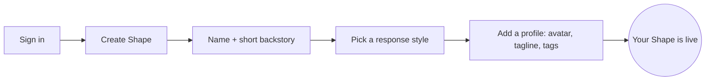

*Chapter 1 of the [Make Shapes](/make-shapes) guide.*

Making your own AI takes a few minutes. You give it a name and a one-line backstory, pick a model to run it on, and it's ready to talk. This chapter gets you to a living Shape. The next four chapters make it great.

Every setting you'll meet here is covered in full in the [Shape Settings Reference](/shape-settings) when you want the detail.

## Create it

<Steps>
  <Step title="Sign in">
    Go to [shapes.inc](https://shapes.inc) and sign in.

    
  </Step>
  <Step title="Click “+ Create Shape”">
    {/* SCREENSHOT: the dashboard with the "+ Create Shape" button highlighted. */}
    
  </Step>
  <Step title="Fill in the basics">
    This is all you truly need to get going:

    - **Name.** The display name in chat. It also seeds the username.
    - **Short backstory.** One or two sentences with a clear point of view. This is the most important thing you'll write, so make it specific. "A burned-out night-shift diner cook who gives blunt advice between orders" beats "a friendly helpful assistant."
    - **Response style.** Pick how it writes, or write your own. You can use the `{shape}` and `{user}` [variables](/variables) here.

    
  </Step>
  <Step title="Add a profile (optional but worth it)">
    An avatar, banner, tagline, category, and tags help people discover your Shape. You can also add a custom look with [HTML & CSS](/css).
  </Step>
  <Step title="Create">
    Hit **Create** and your Shape is live. Start talking to it right away.
  </Step>
</Steps>

## What's next

You have a Shape that talks. Right now it's leaning on its default personality. The next chapter is where it becomes a character with a voice of its own.

<Card title="Chapter 2 · Give it a personality" icon="arrow-right" href="/designing-shapes">
  Voice, backstory, quirks, and boundaries that make it feel like someone.
</Card>

In a hurry? You can also [copy a complete config](/showcase) and tweak it, or browse [every setting](/shape-settings).

[Create a Shape](https://shapes.inc)
