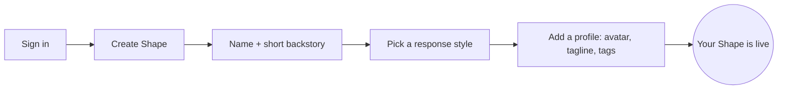

Making your own AI on Shapes takes a few minutes. You give it a name and a personality, pick a model to run it on, and it's ready to talk — and to drop into a [group chat](/ai-group-chats) with your friends.

This is the create flow. For the *craft* of making one genuinely great, read [Designing Great Shapes](/designing-shapes); for every setting in detail, see the [Shape Settings Reference](/shape-settings).

## Create it

<Steps>
  <Step title="Sign in">
    Go to [shapes.inc](https://shapes.inc) and sign in.

    
  </Step>
  <Step title="Click “+ Create Shape”">
    {/* SCREENSHOT: the dashboard with the "+ Create Shape" button highlighted. */}
    
  </Step>
  <Step title="Fill in the basics">
    This is all you truly need to get going:

    - **Name** — the display name in chat (it also seeds the username).
    - **Short backstory** — one or two sentences with a clear point of view. This is the most important thing you'll write; make it specific. ("A burned-out night-shift diner cook who gives blunt advice between orders," not "a friendly helpful assistant.")
    - **Response style** — pick how it writes, or go custom. You can use the `{shape}` and `{user}` [variables](/variables) here.

    
  </Step>
  <Step title="Add a profile (optional but worth it)">
    An avatar, banner, tagline, category, and tags help people discover your Shape. You can also add a custom look with [HTML & CSS](/css).
  </Step>
  <Step title="Create">
    Hit **Create** and your Shape is live. Start talking to it right away.
  </Step>
</Steps>

## Make it yours

Everything beyond the basics lives in the **Creator Dashboard**, and it's all optional — add it as you learn what your Shape needs:

<CardGroup cols={2}>
  <Card title="Every setting, explained" icon="sliders" href="/shape-settings">
    Personality fields, knowledge, training, memory, voice, image engine, and the model — the full reference.
  </Card>
  <Card title="Make it genuinely great" icon="lightbulb" href="/designing-shapes">
    The craft guide: identity, voice, quirks, boundaries, and social intelligence.
  </Card>
  <Card title="Pick a model" icon="cpu" href="/choosing-a-model">
    300+ engines, most free. Find the one that fits your Shape's vibe.
  </Card>
  <Card title="Steal a starting config" icon="grid-2" href="/showcase">
    Copy a complete, ready-to-tweak example and make it your own.
  </Card>
</CardGroup>

## Next: make it social

A Shape is most fun with other people in the room. Once yours feels right, bring it into a [group chat](/create-a-chat) and tune its [social intelligence](/designing-social-intelligence) so it knows when to talk and when to listen.

[Create a Shape](https://shapes.inc)
