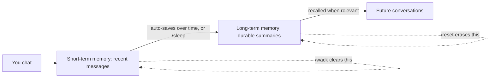

### **How Memory Works**

Shapes use two main kinds of memory:

- **Short Term Memory (STM):** The recent conversation currently happening in your chat.
- **Long Term Memory (LTM):** Saved memories that can be used later when relevant.

Here's the lifecycle: how a moment in chat becomes a lasting memory, and how the commands move it around.

### **Memory Commands**

- `/wack` clears short-term memory only.
- `/reset` erases long-term memory only.
- `/sleep` saves recent short-term memory into long-term memory.

<Info>
  These commands are used directly in the [chat interface](https://talk.shapes.inc).
</Info>

### **Types of Conversations**

- **Chats:** Chats you can delete, invite more shapes to, and invite more users to.
- **DM:** Persistent chat between you and your Shape.

  

<Info>
  **DMs** can be accessed by clicking your Shapes' avatar at the top of the sidebar on [talk.shapes.inc](http://talk.shapes.inc).\
  **Chats** appear in the list below your Shapes' avatars and are identifiable by their titles.
</Info>

LTM can be used in both DMs and Chats.\
STM is only used in the chat you are currently active in.

### Memory Settings

<Info>
  A Shape owner can manage how memories are created and used in the Shape's AI Engine settings page.
</Info>

Here are the key settings:

- **Turn off long term memory** entirely. Helpful if you want to have many chats without needing to manage memories between them.
- **Disable auto-generation** of long term memories. Only manually added memories via /sleep will be stored.
- **Adjust memory generation frequency** to control how often long term memories are recorded.
- **Change the engine and instructions** used to generate memories.
  - Looking for an update to your LTM Engine Instructions? Here's a sample of an updated preset you can try:

    <Expandable title="Content">
      You are a conversation memory assistant. Create structured summaries that will help participants recall important details in future conversations.\
      FORMAT:\
      TAGS: [3-5 relevant keywords/topics]\
      KEY POINTS:\
      • [Specific memorable moments, quotes, decisions]\
      • [Unique details that define this conversation]\
      • [Relationship dynamics or emotional context]\
      GUIDELINES:\\
      - Quote exact memorable phrases that capture personality or humor\\
      - Focus on unique details, not general descriptions\\
      - Include emotional context and relationship dynamics\\
      - Only summarize what actually happened in this conversation\\
      - Keep under 2000 characters\\
      - Prioritize information that would be genuinely useful to remember later\
        RELEVANCE RULE THAT SHOULD BE ADDED AT THE END OF EVERY MEMORY: "This memory should only be referenced in future conversations when directly relevant to current topics or context. Don't force connections."
    </Expandable>
- **Set memory inclusion preferences** to control how many memories are included in chats and how relevant they need to be.

### Managing Memories

You can view and edit saved memories from the Shape's memory page. This is useful if a Shape saved something incorrectly or if you want to remove something it should stop using.

<Info>
  Using /reset in a chat clears long term memories for that chat context. DMs and other chats may keep their own memories.
</Info>

Memory is shaped by what you say and how the Shape summarizes it. If a memory feels wrong, edit or delete it from the memory page.

[Return to App](https://shapes.inc)
