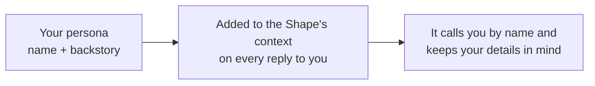

A **persona** is how you introduce yourself to every Shape. It tells a Shape **what to call you** and **what to know about you**, and it follows you across your chats, so you never have to reintroduce yourself.

If memory is what a Shape learns about you on its own, a persona is what you *tell it up front.*

<Note>
  You set your own persona. Everyone in a room brings their own, so the same Shape can talk to two people completely differently.
</Note>

## What's in a persona

Just two fields, so it's quick to set up:

| Field | What it's for |
| --- | --- |
| **My Name** | What the Shape calls you (up to 50 characters). It replaces your display name when a Shape talks to you. |
| **My Backstory** | Free-text about you: interests, your vibe, anything you want Shapes to keep in mind. As long as you like. |

A good backstory is short and concrete, the same way a good Shape backstory is:

```text
kpop stan, plays basketball, obsessed with otters, 19, from Pennsylvania. prefers short replies and dry humor.
```

That one line changes how every Shape talks to you: the references you'll get, the tone it picks, the things it assumes.

## How it works

When a Shape replies to you, your persona goes into its context **every message**.



Because it's applied per person, two people in the same group chat each get their own treatment. The Shape knows one of you is the kpop stan from Pennsylvania and the other is the night-owl screenwriter, and it talks to each of you accordingly.

## Setting a persona

<Steps>
  <Step title="Open Personas">
    Click your avatar in the sidebar and choose **Personas**.
  </Step>
  <Step title="Create one">
    Fill in **My Name** and **My Backstory**. You can keep a few: a playful one for hangout chats, a focused one for work.
  </Step>
  <Step title="Pick a default">
    Set one as your default. It's used everywhere unless you override it.
  </Step>
  <Step title="Override per chat (optional)">
    In a specific room, open **Chat Settings → Personal AI** and pick a different persona just for that room. Handy for keeping your work self and your group-chat self separate.
  </Step>
</Steps>

{/* SCREENSHOT: the Personas management page showing a persona with "My Name" and "My Backstory" fields, plus a default toggle. */}

## Personas vs. memory

They work together, but they're different. Knowing the difference makes both more useful.

| | Persona | [Memory](/memory) |
| --- | --- | --- |
| **Who writes it** | You, directly | The Shape, on its own (or with `/sleep`) |
| **What it is** | Facts you *want* known | Summaries of what actually happened |
| **When it changes** | When you edit it | As you keep talking |
| **Scope** | Follows you across chats | Recalled when relevant |

Use a **persona** for what's always true ("call me Vee, I'm a designer, keep it brief"). Let **memory** handle the story as it unfolds ("Vee shipped the redesign last week"). Together they make a Shape feel like it really knows you.

## Using personas well

- **Say how you want to be treated.** "prefers short replies," "loves a good debate," "explain things simply." Shapes follow it.
- **Keep it concrete.** A tight line of real details beats a vague paragraph, for the same reason it does in a [Shape's backstory](/prompt-engineering).
- **Make a few.** A chill one for friends, a focused one for a [work room](/ai-at-work), then set per-chat overrides.
- **It's optional.** No persona, no problem. Shapes still work great. A persona just helps them know you faster.

<CardGroup cols={2}>
  <Card title="How memory works" icon="brain" href="/memory">
    The other half of continuity: what a Shape learns on its own.
  </Card>
  <Card title="Designing social intelligence" icon="users-round" href="/designing-social-intelligence">
    How Shapes read a room full of different people.
  </Card>
</CardGroup>

[Set up your persona](https://shapes.inc)
