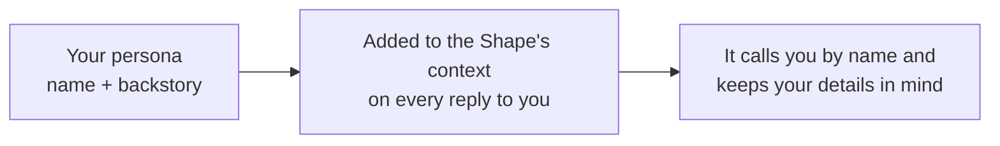

A **persona** is your side of the relationship. It tells a Shape **what to call you** and **what to know about you** — and it travels with you across your chats, so you don't have to reintroduce yourself every time.

If memory is what a Shape learns about you on its own, a persona is what you *tell it up front.*

<Note>
  Personas are something **you** set about yourself — not something a Shape's creator controls. Every person in a room brings their own persona, so the same Shape can greet two people completely differently.
</Note>

## What's in a persona

Two fields, and that's the point — it's quick to set up:

| Field | What it's for |
| --- | --- |
| **My Name** | What the Shape calls you (up to 50 characters). This replaces your display name when a Shape addresses you. |
| **My Backstory** | Free-text context about you — interests, role, vibe, anything you want Shapes to keep in mind. As long as you like. |

A good backstory is concrete and short, the same way a good Shape backstory is:

```text
kpop stan, plays basketball, obsessed with otters, 19, from Pennsylvania. prefers short replies and dry humor.
```

That one line changes how every Shape talks to you — references you'll get, the tone it picks, the assumptions it makes.

## How it works

When a Shape replies to you, your persona is added to its context **every message**:



- **Your name** becomes how the Shape refers to you and how you show up in the conversation, ahead of your display name.
- **Your backstory** is handed to the Shape as standing context about who it's talking to.

Because the persona is applied per person, two people in the same group chat each get their own treatment — the Shape knows that one of you is the kpop stan from Pennsylvania and the other is the night-owl screenwriter, and it talks to each of you accordingly.

## Setting a persona

You can manage personas from a few places:

<Steps>
  <Step title="Open Personas">
    Click your avatar in the sidebar and choose **Personas**, or head to your personas page directly.
  </Step>
  <Step title="Create one">
    Add **My Name** and **My Backstory**. You can keep several personas — a playful one for hangout chats, a focused one for work.
  </Step>
  <Step title="Pick a default">
    Set one persona as your default. It's used in every chat unless you override it.
  </Step>
  <Step title="Override per chat (optional)">
    In a specific room, open **Chat Settings → Personal AI** and choose a different persona just for that room. Great for keeping your work self and your group-chat self separate.
  </Step>
</Steps>

{/* SCREENSHOT: the Personas management page showing a persona with "My Name" and "My Backstory" fields, plus a default toggle. */}

## Personas vs. memory

They work together, but they're different systems — and knowing the difference makes both more useful.

| | Persona | [Memory](/memory) |
| --- | --- | --- |
| **Who writes it** | You, directly | The Shape, automatically (or via `/sleep`) |
| **What it is** | Standing facts you *want* known | Summaries of what actually happened |
| **When it changes** | When you edit it | As you keep talking |
| **Scope** | Carries across your chats | Recalled when relevant |

Use a **persona** for the stuff that's always true ("call me Vee, I'm a designer, keep it brief"). Let **memory** handle the evolving story ("Vee shipped the redesign last week and was stressed about it"). Together they make a Shape feel like it actually knows you.

## Using personas well

- **Lead with how you want to be treated.** "prefers short replies," "loves spicy debate," "explain things simply" — Shapes will follow it.
- **Keep it concrete.** A tight line of real details beats a paragraph of vague ones, for the same reason it does in a [Shape's backstory](/prompt-engineering).
- **Make a few.** A chill persona for friends, a focused one for a [work room](/ai-at-work) — then set per-chat overrides.
- **It's optional.** No persona, no problem — Shapes still work great. A persona just makes them feel like they know you faster.

<CardGroup cols={2}>
  <Card title="How memory works" icon="brain" href="/memory">
    The other half of continuity — what a Shape learns on its own.
  </Card>
  <Card title="Designing social intelligence" icon="users-round" href="/designing-social-intelligence">
    How Shapes read a room full of different people.
  </Card>
</CardGroup>

[Set up your persona](https://shapes.inc)
