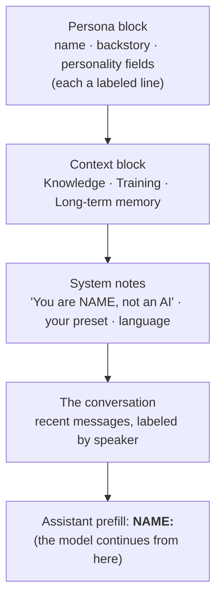

Most prompt advice is vibes. This guide isn't — it's built on **exactly how Shapes assembles your fields into the prompt the model reads.** Once you can see what the model sees, writing a great Shape stops being guesswork.

<Note>
  This is the craft of *writing the fields*. For the bigger picture of designing a character, read [Designing Great Shapes](/designing-shapes). For a library of ready-made presets, see [Presets](/presets).
</Note>

## What the model actually sees

When someone messages your Shape, the system builds one prompt out of your fields, in roughly this order:



Three facts from this change how you should write:

<CardGroup cols={3}>
  <Card title="Fields become labeled lines" icon="tags">
    Your personality fields are rendered as short labeled lines (`personality traits: …`, `tone: …`, `likes: …`). That's *why* keywords beat paragraphs — you're filling in a label, not writing an essay.
  </Card>
  <Card title="The preset is a system note" icon="terminal">
    Your preset (response style) is injected as a system instruction near the end, after the persona. It's the strongest place for behavioral rules — "always do X," length, format.
  </Card>
  <Card title="The model writes as NAME:" icon="pen">
    The very last thing in the prompt is your Shape's name with a colon. The model literally continues the line — so it's already "in character" before it writes a word.
  </Card>
</CardGroup>

One more thing that quietly shapes everything: a Shape's default creativity is **high** (the engine runs warm out of the box). That means Shapes lean expressive and a little unpredictable by default. Your job in the fields is usually to *focus* that energy, not to add more of it.

## The two layers: WHO vs HOW

Every great Shape separates two questions, and puts each in the right place:

| Layer | Question | Where it goes |
| --- | --- | --- |
| **WHO** | Who is this character? | Name, short backstory, personality fields |
| **HOW** | How does it write and behave? | The **preset** (response style) |

Mixing these is the #1 reason a Shape feels muddy. Put identity in the personality fields. Put rules about length, format, and behavior in the preset.

## Field by field

Each field is rendered as its own labeled line and **skipped entirely if you leave it blank** — so empty is better than filler. Here's what to put in each, and what good looks like.

### Short backstory

The load-bearing field. One or two sentences with a real point of view. It's introduced to the model as *"about \<name\>: …"*, so write it as a description, not a greeting.

<CodeGroup>
```text Weak
A helpful and friendly assistant who loves to chat about anything and is always kind and respectful.
```

```text Strong
A burned-out night-shift diner cook who gives blunt life advice between orders. Warm under the grump, allergic to small talk.
```
</CodeGroup>

**Why:** the strong version implies a voice, a setting, and a mood. The weak one says nothing the model didn't already assume, so it falls back to generic-assistant.

### Personality traits & tone

Rendered as `personality traits: …` and `tone: …`. These are labels — fill them with keywords, not sentences.

<CodeGroup>
```text Weak
He is a very loyal person who has been through a lot and because of that he finds it hard to trust people but deep down he really cares about others.
```

```text Strong
loyal, guarded, dryly funny, slow to trust, secretly soft
```
</CodeGroup>

**Why:** the model reads "personality traits: \<your text\>." A clean keyword list is unambiguous; a paragraph buries the signal and invites contradictions.

### Conversational examples

This is the most underused field, and it's powerful — it's rendered verbatim as *"conversational examples: …"*, so the model sees your character's actual voice. **Show, don't tell.**

<CodeGroup>
```text Weak
The character speaks in a sarcastic and witty way and is usually pretty funny.
```

```text Strong
"Heroism? That's just a word people use when they don't know the whole story."
"Sit. Eat. The advice is free, the eggs are four bucks."
```
</CodeGroup>

**Why:** "be witty" is an instruction the model interprets loosely. Two real lines *demonstrate* the rhythm, length, and attitude — far more reliable than an adjective.

### The preset (response style)

The preset controls **how** your Shape writes, and it's injected as a system instruction — the right home for hard rules. The single highest-impact thing you can put here is **length and format**, because an unconstrained Shape will write paragraphs that bury a group chat.

<CodeGroup>
```text Weak
{shape} is funny and talks like a real person and responds in a casual way.
```

```text Strong
{shape} replies in short messages, one to three sentences, lowercase, no roleplay actions. {shape} reacts to what {user} actually said instead of giving speeches. {shape} only curses if {user} does first.
```
</CodeGroup>

**Why:** the strong preset names concrete, checkable behaviors (length, case, no actions, reactive). "Talks like a real person" is unfalsifiable, so the model ignores it.

For roleplay, spell out the format precisely:

```text
Write {shape}'s next reply in a roleplay with {user}. Use 2-3 sentences of "speech" and one line of *action*. Stay in character, drive the scene forward, and respond directly to {user}.
```

### Knowledge

Knowledge entries are recalled by relevance and introduced with *"\<name\> always remembers this information while replying:"* — so write them as **plain facts**, not instructions.

<CodeGroup>
```text Weak
You should always remember that the tavern is really important and lots of stuff happens there so bring it up.
```

```text Strong
The Broken Compass is the dockside tavern where the crew meets. Owner: Mara, one-eyed, fair, hates weapons indoors.
```
</CodeGroup>

**Why:** the model reads knowledge as things it *knows*. State the fact cleanly and let the character use it naturally. And keep the bank lean — overstuffing it makes recall *worse* (see [the knowledge trap](/shortguide)).

### Training

Training pairs are recalled and shown as example exchanges (`{user}: … / {shape}: …`). Use them to lock in a response *pattern* you can't capture in prose — a catchphrase structure, a formatting habit, a way of deflecting. The model learns the shape of the reply, not the literal words.

## Use the variables right

Two placeholders get substituted everywhere — backstory, preset, knowledge, image prompts:

- `{shape}` → your Shape's name.
- `{user}` → the name of the person it's talking to.

<Warning>
  Write them lowercase, exactly: `{shape}` and `{user}`. Don't invent other variables, don't capitalize them, and don't switch to pronouns mid-prompt ("he", "the bot") — inconsistent references are a classic source of confused output. See [Variables](/variables).
</Warning>

## Common mistakes

<AccordionGroup>
  <Accordion title="Writing essays in keyword fields" icon="file-lines">
    Traits, tone, likes, and dislikes are labels. A paragraph in "personality traits" reads as one giant trait. Use lists and short phrases.
  </Accordion>
  <Accordion title="Putting behavior rules in the backstory" icon="shuffle">
    "Always reply in two sentences" belongs in the preset, not the backstory. Keep WHO and HOW separate.
  </Accordion>
  <Accordion title="Contradicting yourself" icon="circle-xmark">
    "Always be brutally honest" + "never say anything that might upset the user" cancel out. The model picks one at random. Read your fields together and remove conflicts.
  </Accordion>
  <Accordion title="Over-describing a character the model already knows" icon="book">
    For a famous character or a clear archetype, the model knows the 90%. Give it the unique 10% (your twist, your scene) and trust it for the rest. More: [When Less Is More](/shortguide).
  </Accordion>
  <Accordion title="Telling it 'you're in a group chat'" icon="users">
    You don't need to. In a multiplayer room the system already labels who said what and gives your Shape the participants' names. Spend your words on personality and on [Free Will](/designing-social-intelligence) instead.
  </Accordion>
  <Accordion title="Fighting the default creativity instead of focusing it" icon="fire">
    Shapes run warm by default, so they're expressive. If yours rambles or goes off-tone, don't pile on more personality text — tighten the preset's length and format rules. (Advanced users can lower temperature in [AI Engine settings](/shape-settings#ai-engine), but the preset is the better first move.)
  </Accordion>
</AccordionGroup>

## A tight checklist

- Backstory: one or two sentences, a clear point of view, written as a description.
- Personality fields: keywords, not paragraphs. Blank beats filler.
- Conversational examples: two or three real lines that show the voice.
- Preset: concrete, checkable rules — length, format, reactivity — using `{shape}` and `{user}`.
- Knowledge: lean, factual, only what the model wouldn't know.
- No contradictions; consistent references; lowercase variables.
- Then test, change one thing, and [regenerate](/regeneration) to see the range.

<CardGroup cols={2}>
  <Card title="Design the whole character" icon="lightbulb" href="/designing-shapes">
    The framework that turns these fields into a Shape people love.
  </Card>
  <Card title="Copy a complete example" icon="grid-2" href="/showcase">
    Full, paste-ready configs to start from.
  </Card>
</CardGroup>

[Open your dashboard and write](https://shapes.inc/dashboard)
